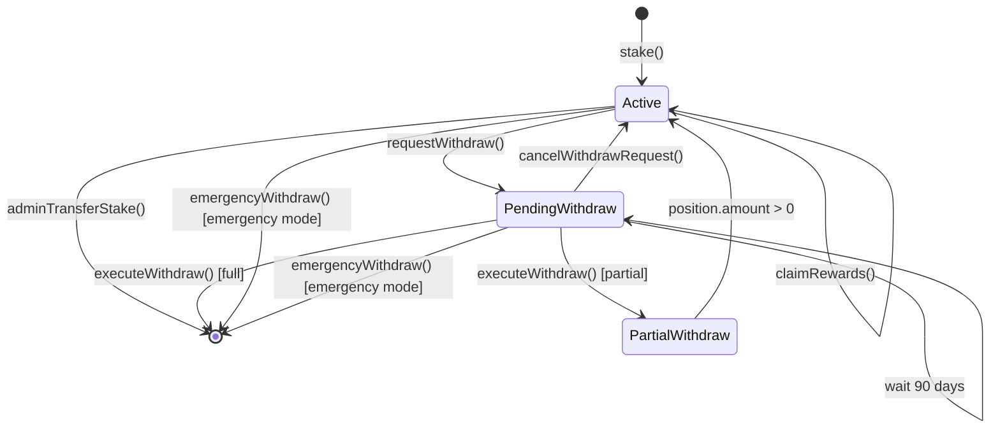
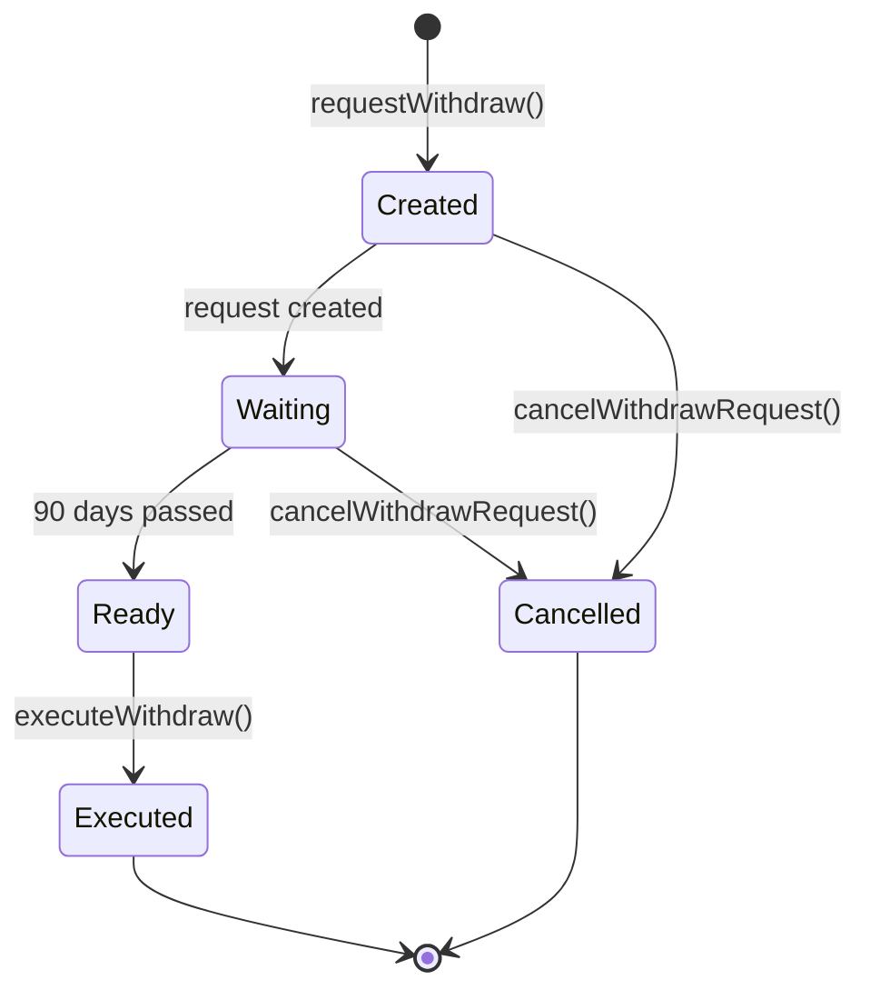

# ProgressiveStaking - Architecture Documentation

## Contract Overview

```mermaid
graph TB
    subgraph External
        USER[User]
        ADMIN[Admin]
        OWNER[Owner/DEFAULT_ADMIN]
        TOKEN[ERC20 Token]
    end

    subgraph ProgressiveStaking
        STAKE[stake]
        CLAIM[claimRewards]
        CLAIMALL[claimAllRewards]
        REQWD[requestWithdraw]
        EXECWD[executeWithdraw]
        CANCELWD[cancelWithdrawRequest]
        EMERGWD[emergencyWithdraw]
        
        DEPOSIT[depositTreasury]
        WITHDRAW[withdrawTreasury]
        UPDATE[updateTierRates]
        PAUSE[pause/unpause]
        SHUTDOWN[emergencyShutdown]
        TRANSFER[adminTransferStake]
    end

    USER --> STAKE
    USER --> CLAIM
    USER --> CLAIMALL
    USER --> REQWD
    USER --> EXECWD
    USER --> CANCELWD
    USER --> EMERGWD

    ADMIN --> PAUSE
    ADMIN --> TRANSFER

    OWNER --> DEPOSIT
    OWNER --> WITHDRAW
    OWNER --> UPDATE
    OWNER --> SHUTDOWN

    STAKE --> TOKEN
    CLAIM --> TOKEN
    EXECWD --> TOKEN
    EMERGWD --> TOKEN
    DEPOSIT --> TOKEN
    WITHDRAW --> TOKEN
```



## State Machine - Stake Position Lifecycle



## State Machine - Withdrawal Request Lifecycle



## Access Control Matrix

| Function | PUBLIC | ADMIN_ROLE | DEFAULT_ADMIN_ROLE | Notes |
|----------|--------|------------|-------------------|-------|
| `stake()` | ✅ | - | - | whenNotPaused |
| `claimRewards()` | ✅ | - | - | whenNotPaused |
| `claimAllRewards()` | ✅ | - | - | whenNotPaused |
| `requestWithdraw()` | ✅ | - | - | whenNotPaused |
| `executeWithdraw()` | ✅ | - | - | Works when paused |
| `cancelWithdrawRequest()` | ✅ | - | - | Works when paused |
| `emergencyWithdraw()` | ✅ | - | - | Only in emergency mode |
| `pause()` | - | ✅ | ✅ | - |
| `unpause()` | - | ✅ | ✅ | - |
| `adminTransferStake()` | - | ✅ | ✅ | nonReentrant |
| `depositTreasury()` | - | - | ✅ | - |
| `withdrawTreasury()` | - | - | ✅ | - |
| `updateTierRates()` | - | - | ✅ | Affects existing stakes |
| `emergencyShutdown()` | - | - | ✅ | IRREVERSIBLE |

## Storage Layout

```solidity
// Immutable
IERC20 public immutable stakingToken;

// State Variables
uint256 public nextStakeId = 1;
uint256 public treasuryBalance;
uint256 public totalStaked;
bool public emergencyMode;

// User Data
mapping(address => StakePosition[]) public userStakes;
mapping(address => mapping(uint256 => uint256)) private stakeIdToIndex;
mapping(address => mapping(uint256 => bool)) private stakeIdExists;

// Withdrawal Data
mapping(address => WithdrawRequest[]) public userWithdrawRequests;
mapping(address => uint256) public pendingWithdrawCount;
mapping(address => mapping(uint256 => bool)) private hasPendingWithdraw;
mapping(address => mapping(uint256 => uint256)) private stakeIdToWithdrawIndex;

// Special Users
mapping(address => bool) public isFounder;

// Tier Configuration
TierConfig[6] public tiers;
```

## Tier Configuration

| Tier | Duration | APY | Rate (basis points) |
|------|----------|-----|---------------------|
| 1 | 0-6 months | 0.5% | 50 |
| 2 | 6-12 months | 0.7% | 70 |
| 3 | 12-24 months | 2.0% | 200 |
| 4 | 24-36 months | 4.0% | 400 |
| 5 | 36-48 months | 5.0% | 500 |
| 6 | 48+ months | 6.0% | 600 |

## Security Features

### Modifiers Used
- `nonReentrant` - All state-changing functions
- `whenNotPaused` - User functions (except executeWithdraw, cancelWithdrawRequest)
- `onlyRole(ADMIN_ROLE)` - pause, unpause, adminTransferStake
- `onlyRole(DEFAULT_ADMIN_ROLE)` - treasury, tier rates, emergency

### Protection Mechanisms
1. **Reentrancy Guard** - OpenZeppelin ReentrancyGuard
2. **Safe Token Transfers** - OpenZeppelin SafeERC20
3. **Access Control** - OpenZeppelin AccessControl
4. **Pausable** - OpenZeppelin Pausable
5. **DoS Prevention** - MAX_PENDING_WITHDRAWALS = 10
6. **Stake Count Limit** - MAX_STAKES_PER_ADDRESS = 1000
7. **Minimum Stake** - MIN_STAKE_AMOUNT = 0.001 tokens

Operational note: The `MAX_PENDING_WITHDRAWALS` cap is enforced per address. Custodial/Web2 integrations that aggregate many users under a single address should shard custody across multiple addresses and use `adminTransferStake` to move positions before creating withdrawal requests.

### Invariants
1. `totalStaked + treasuryBalance == token.balanceOf(contract)` (after all operations)
2. `pendingWithdrawCount[user] <= MAX_PENDING_WITHDRAWALS`
3. `position.amount >= 0` for all positions
4. `stakeId` is globally unique and incrementing

## External Dependencies

| Dependency | Version | Purpose |
|------------|---------|---------|
| OpenZeppelin Contracts | 5.x | AccessControl, Pausable, ReentrancyGuard, SafeERC20 |
| ERC20 Token | Any | Staking token (immutable after deployment) |

## Known Risks & Mitigations

| Risk | Severity | Mitigation |
|------|----------|------------|
| Treasury depletion | Medium | Admin monitoring, depositTreasury function |
| Tier rate changes affect existing stakes | Low | By design - documented behavior |
| Emergency mode is irreversible | Low | By design - last resort option |
| Array growth in userWithdrawRequests | Low | Executed requests marked, not deleted |
| Admin key compromise | Medium | Use multisig, consider timelock |
